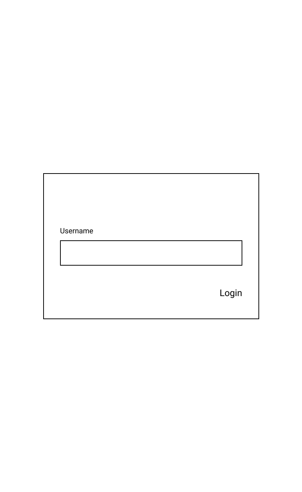
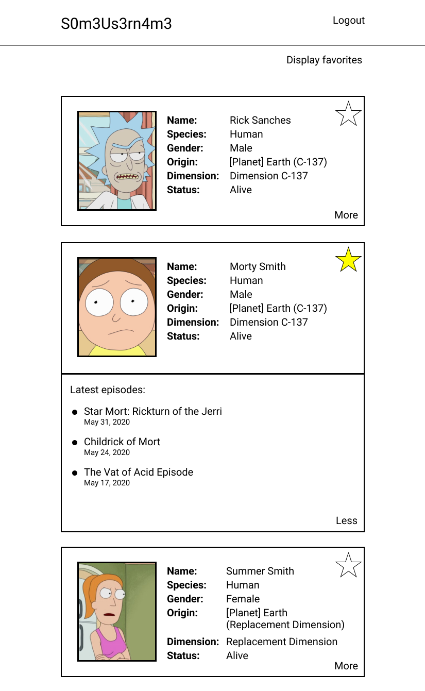
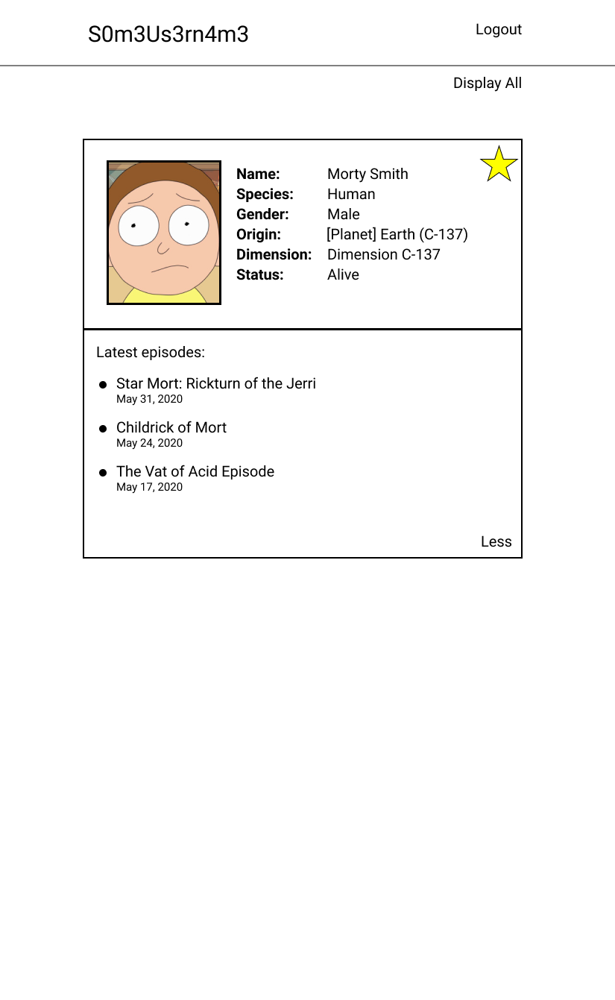

# coding-challenge-fullstack-engineer-s

## Specification

Hello!

In order for us to see a bit of how you work and a bit of what you know we came up with this technical challenge. Here you're going to consume from a publicly accessible Graphql API and display some of its information in a web page.

We're are going to be using the [Rick And Morty API](https://rickandmortyapi.com/graphql) for that.
You can find the documentation for the API [here](https://rickandmortyapi.com/documentation).

The requirements for this project are found below. Please read them carefully. We usually try to avoid any tricks or traps in this type of tests so if something is not clear please don't hesitate to contact us.

### 0 - Login screen

- There's a login form in which the user can type in a username
  - If the username doesn't exist a new one is created
  - If the usernamne already exists the data from it is retrieved

- After login a button on top for "logout" should be displayed
  - When clicked, the user must be taken back to the login screen

- If a user is logged in, reloading the page must preserve it until the "logout" button is clicked

### 1 - Implement a list of character cards

- There must be a list of character cards consisting of the following character information:
  - image
  - name
  - species
  - gender
  - origin
  - dimension
  - status

- The list must contain all the charaters from the 1st page returned by the api

### 2 - Make the character card expandable with extra information

- There must be a "more" button that, when clicked, expands the card to display a list of the 3 latests episodes that character was displayed in.

- The list of latests episodes must be sorted from the most recent to the oldest episode.

- When the list of latests episodes is open the "more" button becomes a "less" button.

- When the "less" button is clicked the list of latests episodes is collapsed and the "less" button becomes a "more" button.

- Only one card must be expanded. So when a collapsed card is expanded any other expanded card must collapse automatically.

### 3 - Mark your favorite characters

- There must be a "favorite" button on a character card that, when clicked, marks a character as favorite

- There must ba a "Display favorites" button on top of the page
  - When clicked the button changes to "Display all" and only favorited character cards are displayed
  - When "Display all" is clicked, the button changes back to "Display favorites"

- When the page is reloaded the list of favorited characters must be preserved

- The list of favorited characters must be preserved per username

### 4 - Appearance and Code Style

- Your design can be simple but must be consistent and usable (here an [example](#example-of-layout) of what it could look like). So please pay attention to consistency in spacing, readability, usability etc.

- Your code must be clean and easy to understand. So please think of how you name your functions and variables, how you separate concerns within your code, how you organize your modules, how you name your CSS classes, which HTML tags you choose etc.

### 5 - Fetching Data

- Imagine that requesting data from the [Rick And Morty API](https://rickandmortyapi.com/graphql) is very costly per request and that such data doesn't change often:
  - There must be a server to fetch the data from (i.e [Rick And Morty API](https://rickandmortyapi.com/graphql) should _**NOT**_ be accessed directly by the frontend).
  - The server must expose a GraphQL API to fetch the data.
  - Everytime data is fetched from [Rick And Morty API](https://rickandmortyapi.com/graphql) it should be stored in a local server database.
  - The data stored on the local server database should expire from time to time. 
  - Expired data should be fetched from [Rick And Morty API](https://rickandmortyapi.com/graphql) again and replaced with the newer version in local server database.

### Bonus - Docker

- Not required, but if you have *zeit und lust* you can dockerize your solution.
  - Internally we use [docker-compose](https://docs.docker.com/compose/) so everything can be run with only one command (`docker-compose up`), but feel free to use anything you want (docker-compose, bash scripts etc), just don't forget to add the instructions on how to run it to the documentation.

### Bonus - Pagination

- Not required, but if you have *zeit und lust* you can make your solution paginated and display the rest of the pages from the API
  - You choose how to do it (infitite scroll, pages with a page counter etc).

<h3 id="example-of-layout">Example of layout</h3>

The below are only an example. Feel free to follow it or to come up with your own.

### Bonus - Code quality

- If you have *zeit und lust* you can setup a linter to ensure your code style stays consistent throughout the entire application

## Requirements

- You must use **React**. This is the main library in our frontend currently.
- You must use **GraphQL**. This is the main way our frontend retrieves data currently..
- You can use any CSS preprocessors like SASS, LESS etc. 
- You can use styled-components.
- Do **NOT** use any CSS frameworks (Bootstrap, Tailwind etc) or any React UI Library (Material-ui, Kendo-ui etc) since those make it difficult for us to assess your CSS skills.

## How to Deliver

- Fork this repository

- When you're done push your changes and send us the link to your fork (don't worry, this is a private repo, noone but us is gonna know)
  - If you feel more comfortable, you can deliver it on another source code hosting (like Gitlab), send us your solution via e-mail in a compacted file or as a link to compacted file in a storage service (like Google Drive, Dropbox, AWS S3).

- Please attach to this README.md any considerations you have or any instructions to setup and run your code if it differs from `yarn/npm install` & `yarn/npm start`

- Please feel free to reach out if something is not clear or you have any questions. We will be glad to interact with you and answer any question you may have.

## Tips & Tricks

- If it's taking you more than 5-6 hours to complete this challenge, check if you're not overcomplicating something. Try to keep it simple, clean and smart.

- Feel free to choose which DBMS to use (SQLite, a text file, MySQL, PostgreSQL, MongoDB, CouchDB...), just keep it simple to setup and initialize, and add instructions on how to do it to the README file.

- Feel free to install any libraries you think may be necessary, but remember it's not such a complicated project so try to avoid things that could be easily solved with vanilla JS. E.g.:
  - lodash :thumbsup:
  - [leftpad](https://qz.com/646467/how-one-programmer-broke-the-internet-by-deleting-a-tiny-piece-of-code/) :thumbsdown:

- Commit frequently. If you want you can adopt some commit convention like [conventional commits](https://www.conventionalcommits.org/en/v1.0.0/).

- We'll have time to discuss a bit more about this project in a later moment, so take note of any improvements you'd make if this is a real-life project and, if any, the corners you had to cut.

 
 
 
 

Good Luck!

We're looking forward to see what you can do!

